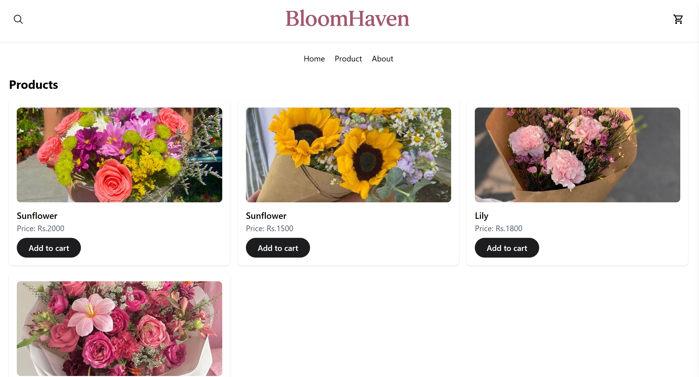

# 🌸 BloomHaven

## 🌐 Project Overview

**BloomHaven** is a modern and elegant **e-commerce website** built with **React.js** and **Tailwind CSS**.  
It provides a smooth shopping experience with clean UI components, dynamic product listings, and full responsiveness across all devices.


---

## 🛠️ Tech Stack

| Technology               | Purpose                                               |
| ------------------------ | ----------------------------------------------------- |
| ⚛️ **React.js**          | Front-end library for building reusable UI components |
| 🎨 **Tailwind CSS**      | Utility-first CSS framework for quick, modern styling |
| 💻 **JavaScript (ES6+)** | Adds interactivity and logic                          |
| ⚡ **Vite**              | Development server and fast build tool                |

---

## 🚀 Features

- 🛒 **Interactive Product Display** – Show products dynamically  
- 🔍 **Product Search & Filter** – Easy browsing experience  
- ❤️ **Add to Favorites/Cart** – Save products for later  
- 💳 **Checkout Page** – Simple and elegant payment UI  
- 📱 **Fully Responsive Design** – Works seamlessly on all screen sizes  
- ⚡ **Fast Performance** – Powered by Vite and React  

---

## 📸 Preview


!()


---

## 🧑‍💻 Setup Instructions

Follow these steps to run the project locally:

```bash
# 1️⃣ Clone the repository
git clone https://github.com/NuxGajurel/BloomHaven-e-commerce-.git

# 2️⃣ Navigate to the project folder
cd BloomHaven

# 3️⃣ Install dependencies
npm install

# 4️⃣ Run the development server
npm run dev
